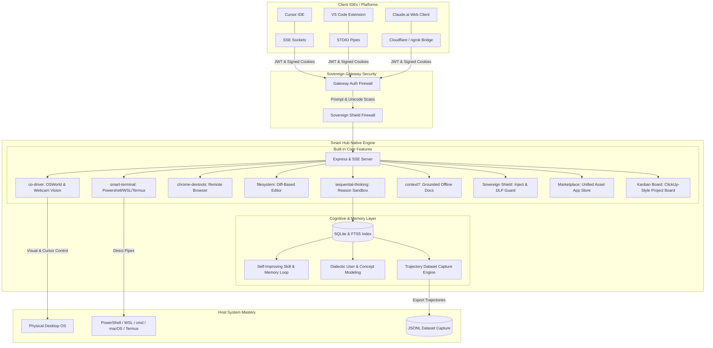

# 🌌 Smart Hub | The Sovereign AI Orchestration OS

A state-of-the-art, zero-config local runtime designed to unify disparate AI agents, client IDEs, and heavy-compute layers into a single, cohesive, self-improving cognitive engine. 

Smart Hub compiles **all core capabilities directly into its codebase**, eliminating dynamic configuration loops and granting connecting LLMs 100% absolute control of the host machine's desktop, terminals, file vectors, and webcam vision feeds.

---



---

## ⚡ Core Features of the Smart Hub

Smart Hub is engineered as a single, compiled server executable. Once launched, these built-in features function instantly, requiring zero external server setup or NPM installations.

### 🎥 1. `co-driver` Visual OS Control
*   **OSWorld Physical Automation:** Native, low-latency API wrappers to programmatically control the host operating system's mouse, keyboard, coordinates, and visual layout.
*   **Webcam Vision Stream:** Dynamic webcam integration that captures real-time video frames and environmental vision feeds, supplying connecting multimodal LLMs with high-fidelity visual context.

### 💻 2. `smart-terminal` Multi-Shell pipe
*   **Universal Shell Abstraction:** Establishes direct, high-performance terminal pipes across operating systems. 
*   **Persistent Shell Support:** Native control over **PowerShell**, **cmd**, **bash**, **WSL (Ubuntu)**, macOS **zsh**, and Android **Termux** in the background.
*   **Workspace Substitution:** Dynamic workspace root substitution, automatically replacing relative paths with project workspace roots (`%BASE_DIR%`).

### 🌐 3. `chrome-devtools` Browser Automation
*   **DevTools Programmatic Browser:** Programmatically spawns headless and headful Chromium browser instances using local devtools protocols.
*   **High-Performance Scrapers:** Exposes native tools to select, click, fill forms, extract text, scrape dynamic SPA sites, and capture screenshots in sub-second latency cycles.

### 📝 4. `filesystem` Diff-Based Editing
*   **Block-Level Diff Editor:** Enforces strict, block-level target replacements when modifying codebases instead of rewriting entire files.
*   **Massive Cost Reductions:** Prevents prompt-inflation, preserves all unrelated comments/docstrings, and cuts LLM context token consumption by up to 90%.

### 🧠 5. `sequential-thinking` Reasoning Sandbox
*   **High-Fidelity Thinking Space:** Implements a dynamic, recursive reasoning engine letting agents think mathematically and procedurally in structured sandbox loops.
*   **Persistent Traces:** Commits every reasoning trajectory to SQLite, creating complete diagnostic traces that survive system reboots for cross-session debugging.

### 📚 6. `context7` Grounded Offline Docs
*   **Version-Specific Document Parser:** Built-in offline technical document indexing server that grounds connecting agents in version-specific library documentations.
*   **Hallucination Prevention:** Instantly supplies accurate, local API schemas and structures, completely cutting out code hallucination loops.

### 🛡️ 7. `Sovereign Shield` Prompt Injection & DLP Security
*   **Prompt Injection Defense:** Instantly detects and blocks 10 categories of prompt injection attacks across 5 adjustable severity levels.
*   **External Source Escalation:** Implements strict data security boundaries—content fetched from URLs, webhooks, or emails is placed in isolated, untrusted wrappers, preventing it from being treated as direct system instructions.
*   **Jailbreak Detection:** Proactively intercepts DAN modes, developer mode overrides, and system-prompt extraction exploits.
*   **Secret Exfiltration Guard:** Dynamically scans outgoing agent responses, blocking accidental leaks of credentials, private keys, passwords, or JWTs.
*   **Unicode Obfuscation Guard:** Automatically catches zero-width characters and obfuscated payloads designed to bypass standard safety text filters.

### 🔄 8. Self-Improving Skill & Memory Loop
*   **Agent-Curated Memory & Nudges:** Set up background cron triggers to run periodic reflective summaries over raw terminal and database activity logs.
*   **Autonomous Skill Creation:** Programmatically synthesizes custom, reusable `SKILL.md` documents directly in your workspace at the end of complex, successful tasks.
*   **Skills Self-Refinement:** Built-in skills dynamically self-refine their instruction files based on structural success/failure traces recorded in the database.
*   **FTS5 Session Search:** Leverages a high-performance **SQLite FTS5 index** for instantaneous text-search and summarizations of past cognitive paths.

### 👥 9. Dialectic User & Concept Modeling
*   **Dynamic Relational Graphing:** Tracks and reasons about changing relationships between people, agents, active projects, and core concepts over time.
*   **Insight Engine:** Runs background dialectic modeling engines to let agents query representations and retrieve natural-language user constraints.

### 📊 10. Trajectory Dataset Capture Engine
*   **Batch Trajectory Capture:** Structured tracking of every step-by-step tool call, input, and output.
*   **Trajectory Compression:** Compacts execution trajectories and exports them as clean **JSON Lines datasets**, supplying perfect training data to fine-tune future local tool-calling models.

### 🏪 11. Built-in Asset Marketplace
*   **Visual App Store:** A responsive visual grid built into the dashboard letting users search, filter, and preview community-curated assets.
*   **1-Click Direct Install:** Direct `[Install]` button to instantly parse and import selected agent personas or plugins (MCPs) directly into your local database.
*   **Creator Details:** Displays the asset's Name, Description, and the GitHub username of the creator (linked directly back to their GitHub profile).
*   **Support & Give Stars:** A prominent `[Give Stars]` button that deep-links directly back to the creator's GitHub repository or user section, allowing users to easily support their work.

### 📋 12. Interactive Kanban Task Board
*   **SQLite-Backed Checklist Dashboard:** A ClickUp-style visual dashboard displaying nested projects, tasks, and subtasks across Kanban columns (`Todo`, `In Progress`, `In Review`, `Done`).
*   **State Continuity APIs:** Exposes robust task operations to connecting LLMs, allowing agents to automatically inspect, plan, build, and update the task board as they execute goals.

---

## 🔒 Security Gateway & Active Lifecycle Controls

Smart Hub keeps your environment secure and under your absolute command:

> [!IMPORTANT]
> **Sovereign Gateway Authentication:** Every SSE, WebSocket, and HTTP request is shielded by cryptographically signed JWT/Bearer token handshakes and signed Cookie validation. Host IP filtering blocks external network scans, locking down the Smart Hub to your localhost and verified VPN subnets.

> [!TIP]
> **Active Lifecycle Sockets:** Smart Hub introduces active engine freeze and hot-reload hooks:
> *   `/api/lifecycle/pause`: Freezes running terminal spawns, suspends active `/goal` executions, and halts sequential thinking paths mid-flight without losing memory states.
> *   `/api/lifecycle/restart`: Gracefully hot-reloads configurations and boots SSE channels dynamically.

---

## 🚀 Getting Started (Windows)

### 1. Prerequisites
Ensure [Node.js (v18+)](https://nodejs.org/) and Git are installed.

### 2. Secure Local Setup
1.  Clone this repository to your target development directory:
    ```bash
    git clone https://github.com/David2024patton/smart-hub.git
    cd smart-hub
    ```
2.  Run the secure setup pipeline:
    *   Right-click `setup.ps1` and select **Run with PowerShell**.
    *   This compiles source files, creates SQLite tables, establishes FTS5 indices, and configures the PM2 process.

### 3. Connecting to the Hub

*   **Via STDIO (Best for Cursor & VS Code):**
    ```bash
    node dist/server.js --mcp
    ```
*   **Via SSE HTTP Sockets:**
    ```text
    http://localhost:47900/sse
    ```

---

## 🛠️ Secure Remote Git Synchronization

Smart Hub integrates an automated Remote Git Push pipeline inside its post-phase protocols, ensuring your workspace is backed up to GitHub after every major milestone.

To configure remote backups securely without committing keys:
1.  Open your secure [agent/creds.md](file:///C:/Users/David/.gemini/antigravity/scratch/agent/creds.md) vault.
2.  Set your personal access token:
    ```markdown
    * **GitHub PAT**: github_pat_YOUR_TOKEN_HERE
    ```
3.  The server automatically loads this token into `process.env.GITHUB_PAT` to authorize git pushes securely, keeping the token 100% hidden from codebase versions.

---

**Developed by David Patton**  
*Building the future of sovereign, self-improving agent orchestration.*
