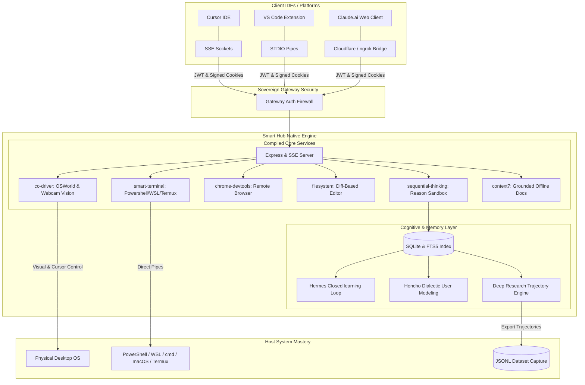

# 🌌 Smart Hub | The Sovereign AI Orchestration OS

A state-of-the-art, zero-config local runtime designed to unify disparate AI agents, client IDEs, and heavy-compute layers into a single, cohesive, self-improving cognitive engine. 

Smart Hub compiles **6 Core Engines directly into its runtime framework**, eliminating dynamic configuration loops and granting connecting LLMs 100% absolute control of the host machine's desktop, terminals, file vectors, and webcam vision feeds.

---



---

## ⚡ Compiled Core Engines (Zero-Config Framework)

Unlike legacy MCP aggregators that spawn external, brittle processes, Smart Hub compiles its core capabilities directly into the Node.js server. When launched, these services function instantly:

| Core Service | Capability | System Mastery |
| :--- | :--- | :--- |
| **`co-driver`** | Native OSWorld-style visual control & mouse/keyboard automation. | Real-time **Webcam Video Feed** capture for multi-modal sensing. |
| **`smart-terminal`** | Persistent terminal piping with absolute shell abstraction. | 100% shell control over **PowerShell**, **cmd**, **bash**, **WSL (Ubuntu)**, and Android **Termux**. |
| **`chrome-devtools`** | Headless/headful remote browser devtools pipelines. | Full programmatic DOM control, element clicking, typing, and page capturing. |
| **`filesystem`** | Strict, block-level **Diff-Based file editing** system. | Eliminates god-file overwrites, preventing token-inflation and saving 90% in bills. |
| **`sequential-thinking`** | Dynamic, high-fidelity recursive reasoning sandbox. | Direct SQLite tracing, storing exact logical paths for cross-session diagnostic audits. |
| **`context7`** | Grounded, version-specific offline technical library parser. | Supplies immediate local documentation, eliminating agent hallucinations. |

---

## 🧠 Cognitive Architecture & Learning Loops

Smart Hub embeds cutting-edge open-source memory frameworks to give your AI agents stateful continuity:

### 1. Hermes Closed-Loop Learning Engine
*   **Agent-Curated Memory & Nudges:** Automatic background cron triggers issue periodic reflective memory nudges, distilling raw action logs.
*   **Autonomous Skill Creation:** Programmatically synthesizes custom, reusable `SKILL.md` documents directly in your workspace at the end of complex tasks (fully compatible with the **agentskills.io** open standard).
*   **Skills Self-Improvement:** Custom skills dynamically self-refine their instruction files based on structural success/failure traces recorded in the database.
*   **FTS5 Session Search:** Leverages a high-performance **SQLite FTS5 index** for instantaneous text-search and summarizations of past cognitive paths.

### 2. Honcho Dialectic User Modeling
*   Tracks and reasons about changing relationships between people, agents, active projects, and concepts over time.
*   Runs background dialectic modeling engines to let agents query peer representations and retrieve natural-language user constraints.

### 3. Deep Research Trajectory Engine
*   **Batch Trajectory Capture:** Structured tracking of every step-by-step tool call, input, and output.
*   **Trajectory Compression:** Compacts execution trajectories and exports them as clean **JSON Lines datasets**, supplying perfect training data to fine-tune future local tool-calling models.

---

## 🔒 Security Gateway & Active Lifecycle Controls

Smart Hub keeps your environment secure and under your absolute command:

> [!IMPORTANT]
> **Sovereign Gateway Authentication:** Every SSE, WebSocket, and HTTP request is shielded by cryptographically signed JWT/Bearer token handshakes and signed Cookie validation. Host IP filtering blocks external network scans, locking down the Smart Hub to your localhost and verified VPN subnets.

> [!TIP]
> **Active Lifecycle Sockets:** Smart Hub introduces active engine freeze and hot-reload hooks:
> *   `/api/lifecycle/pause`: Freezes running terminal spawns, suspends active `/goal` executions, and halts sequential thinking paths mid-flight without losing memory states.
> *   `/api/lifecycle/restart`: Gracefully hot-reloads configurations and boots SSE channels dynamically.

---

## 🚀 Getting Started (Windows)

### 1. Prerequisites
Ensure [Node.js (v18+)](https://nodejs.org/) and Git are installed.

### 2. Secure Local Setup
1.  Clone this repository to your target development directory:
    ```bash
    git clone https://github.com/David2024patton/smart-hub.git
    cd smart-hub
    ```
2.  Run the secure setup pipeline:
    *   Right-click `setup.ps1` and select **Run with PowerShell**.
    *   This compiles source files, creates SQLite tables, establishes FTS5 indices, and configures the PM2 process.

### 3. Connecting to the Hub

*   **Via STDIO (Best for Cursor & VS Code):**
    ```bash
    node dist/server.js --mcp
    ```
*   **Via SSE HTTP Sockets:**
    ```text
    http://localhost:47900/sse
    ```

---

## 🛠️ Secure Remote Git Synchronization

Smart Hub integrates an automated Remote Git Push pipeline inside its post-phase protocols, ensuring your workspace is backed up to GitHub after every major milestone.

To configure remote backups securely without committing keys:
1.  Open your secure [agent/creds.md](file:///C:/Users/David/.gemini/antigravity/scratch/agent/creds.md) vault.
2.  Set your personal access token:
    ```markdown
    * **GitHub PAT**: github_pat_YOUR_TOKEN_HERE
    ```
3.  The backend server automatically loads this token into `process.env.GITHUB_PAT` to authorize git pushes securely, keeping the token 100% hidden from codebase versions.

---

**Developed by David Patton**  
*Building the future of sovereign, self-improving agent orchestration.*
