# 🌌 Smart Hub | The Sovereign AI Orchestration OS

> **A unified, self-improving cognitive workspace** designed to compile all core systems—desktop visual engines, terminal pipelines, multi-shell executors, PostgreSQL memory layers, and security gateways—directly into a high-performance cross-platform application.

<div align="center">

[?style=flat-square)](./logs/phase_0_documentation.md)
[?style=flat-square)](./LICENSE)
[](https://www.rust-lang.org)
[](https://tauri.app)
[](https://www.typescriptlang.org)

</div>

---

## ✨ Vision

Smart Hub is not just another AI assistant—it's a **sovereign cognitive operating system** that:

🧠 **Never Forgets**: Persistent PostgreSQL memory with vector embeddings for RAG  
🔐 **Self-Securing**: Built-in PII masking, prompt injection defense, and DLP  
⚡ **Zero-Latency**: Native Rust backend with async PTY terminal orchestration  
🎨 **Stunning UI**: Glassmorphic HSL dark theme with micro-interactions  
🔄 **Self-Improving**: Hermes loop for autonomous skill curation & optimization  
🌐 **MCP-Native**: First-class support for Model Context Protocol servers  

---

## 🗺️ Master Roadmap

```mermaid
graph LR
    P0[Phase 0: UI/UX Design System] --> P1[Phase 1: Rust Backend]
    P1 --> P2[Phase 2: PostgreSQL Primitives]
    P2 --> P3[Phase 3: Terminal Matrix]
    P3 --> P4[Phase 4: Agent Bridge & Hermes Loop]
    P4 --> P5[Phase 5: RAG Lab & Search]
    P5 --> P6[Phase 6: Connections & Tunnels]
    P6 --> P7[Phase 7: /goal Orchestrator]
    P7 --> P8[Phase 8: Sovereign Shield Security]
    P8 --> P9[Phase 9: Production Release]
    P9 --> P10[Phase 10: Multi-Tenant Cloud]
    P10 --> P11[Phase 11: Community Marketplace]
    P11 --> P12[Phase 12: Local Model Fine-Tuning]
    P12 --> P13[Phase 13: Third-Party Integrations]
```



### Current Status: 🟢 Phase 0.1 Complete

✅ Glassmorphic HSL theme system  
✅ Responsive AppShell with collapsible sidebar  
✅ Strict TypeScript configuration  
✅ Rust backend scaffolding with health endpoint  
✅ Type-safe IPC bridge foundation  
✅ Component library scaffolding  

➡️ **Next**: Phase 1 - PostgreSQL integration & Repository Pattern  

---

## 🚀 Quick Start

### Prerequisites
- Node.js 18+ & npm 9+
- Rust 1.70+ with `cargo`
- PostgreSQL 15+ (optional for Phase 2+, auto-bootstrapped later)
- Windows 10+/macOS 10.15+/Linux (glibc 2.28+)

### Installation

```bash
# Clone the repository
git clone https://github.com/David2024patton/smart-hub.git
cd smart-hub/001

# Install frontend dependencies
npm install

# Install Rust Tauri CLI (if not already installed)
cargo install tauri-cli --version "^1.5"

# Run in development mode
npm run tauri dev

# Or run frontend + backend separately for debugging
npm run dev          # Vite dev server on http://localhost:1420
# In another terminal:
cd src-tauri && cargo run
```

### Build for Production

```bash
# Build frontend
npm run build

# Build native app
npm run tauri build

# Outputs in src-tauri/target/release/bundle/
```

---

## 🛠️ Development Commands

| Command | Description |
|---------|-------------|
| `npm run dev` | Start Vite dev server (frontend only) |
| `npm run tauri dev` | Launch full Tauri app in dev mode |
| `npm run build` | Build frontend for production |
| `npm run tauri build` | Build native app binaries |
| `npm run typecheck` | Run TypeScript strict validation (`tsc --noEmit`) |
| `npm run lint` | Run ESLint on frontend code |
| `npm run rust:check` | Run `cargo check` on Rust backend |
| `npm run rust:clippy` | Run `cargo clippy` with strict warnings |
| `npm run health` | Run all health checks (typecheck + rust:check) |

---

## 📁 Project Structure

```
smart-hub/001/
├── 📄 package.json              # Frontend deps & scripts
├── 📄 tsconfig.json            # Strict TypeScript config
├── 📄 vite.config.ts           # Vite + React + Tauri config
├── 📄 index.html               # HTML entry point
├── 📄 .gitignore               # Git ignore rules
├── 📄 README.md                # This file
│
├── 📁 src/
│   ├── 📁 renderer/            # React frontend
│   │   ├── 📄 main.tsx         # Entry point
│   │   ├── 📄 App.tsx          # Root component
│   │   ├── 📄 index.css        # Master CSS theme (HSL glassmorphic)
│   │   ├── 📁 components/      # Reusable UI components
│   │   └── 📁 hooks/           # Custom React hooks
│   │
│   └── 📁 types/
│       └── 📄 schemas.ts       # Shared TS interfaces (maps to Rust serde)
│
├── 📁 src-tauri/               # Rust backend (Tauri)
│   ├── 📄 Cargo.toml          # Rust dependencies
│   ├── 📄 build.rs            # Tauri build script
│   ├── 📄 tauri.conf.json     # Tauri configuration
│   └── 📁 src/
│       └── 📄 main.rs         # Rust entry point + IPC commands
│
├── 📁 logs/                    # Phase documentation & debug logs
│   └── 📄 phase_0_documentation.md
│
└── 📁 icons/                   # App icons (to be added)
```

---

## 🔐 Security & Compliance

### Built-In Protections
- ✅ **No AI Slop Policy**: Strict design guidelines enforced in code reviews
- ✅ **No Secret Commits**: Credentials pulled from env/config vaults only
- ✅ **No Heavy Dependencies**: Core backend is pure Rust (no Node.js/Python/Go runtime)
- ✅ **Strict Type Safety**: `tsc --noEmit` + `cargo clippy -- -D warnings` in CI
- ✅ **CSP Hardening**: Content Security Policy restricts resource loading
- ✅ **Scoped Permissions**: File system access limited to user directories

### Post-Phase Protocol
After each phase completion, developers **must**:
1. Refactor & clean up code (remove dead code, enforce typing)
2. Verify & lint (`tsc --noEmit` + `cargo clippy`)
3. Deploy diagnostic tests (window states, IPC, DB locks)
4. Document changes in `logs/phase_N_documentation.md`
5. Commit & push cleanly to remote
6. Trigger context compaction for LLM state snapshots

---

## 🧩 Core Features Matrix

| Feature | Status | Description |
|---------|--------|-------------|
| **co-driver** | 🔜 Phase 4 | Win32 UI Automation for background clicks + webcam vision |
| **smart-terminal** | 🔜 Phase 3 | Native PTY orchestrator for PowerShell, bash, WSL, zsh, Termux |
| **chrome-devtools** | 🔜 Phase 6 | Headless browser automation pipelines |
| **filesystem** | ✅ Phase 0 | Native Rust file watchers with diff-based editing engine |
| **sequential-thinking** | ✅ Phase 0 | Recursive reasoning space with structured trace logging |
| **context7 & pgvector** | 🔜 Phase 2 | Local PostgreSQL with ONNX embeddings + offline docs parsing |
| **hermes-loop** | 🔜 Phase 4 | Self-improving skill curation & autonomous reflection engine |

---

## 🤝 Contributing

1. Read the [Phase Documentation](./logs/) for current implementation details
2. Follow the **No AI Slop** design directives in `todo4.md`
3. Ensure all changes pass: `npm run health`
4. Document new features in the appropriate `logs/phase_N_documentation.md`
5. Submit PR with clear description and test coverage

### Code Style
- **Frontend**: ESLint + Prettier config (to be added), strict TypeScript
- **Backend**: `rustfmt` + `clippy` with pedantic warnings
- **Commits**: Conventional Commits format (`feat:`, `fix:`, `docs:`, etc.)

---

## 📚 Documentation

- [Phase 0 Documentation](./logs/phase_0_documentation.md) - UI/UX Design System
- [TypeScript Schemas](./src/types/schemas.ts) - Shared type definitions
- [Rust Backend](./src-tauri/src/main.rs) - Core IPC commands & models

---

## 🆘 Support & Debugging

### Health Endpoint
Access real-time diagnostics via the UI health indicator or IPC:
```typescript
import { invoke } from '@tauri-apps/api/tauri'
const health = await invoke('health_check')
console.log(health) // System metrics, DB status, active sessions
```

### Log Locations
- **Frontend**: Browser dev console + `logs/frontend.log` (when built)
- **Backend**: `logs/smart-hub.log` (rolling daily files)
- **Database**: PostgreSQL logs in `pg_data/log/` (when Phase 2 active)

### Common Issues
| Issue | Solution |
|-------|----------|
| `health_check` fails in dev | Backend not running - use `npm run tauri dev` |
| Fonts not loading | Check internet connection or self-host fonts |
| Rust compile errors | Ensure Rust 1.70+ and run `rustup update` |
| Tauri window not appearing | Check OS permissions for window creation |

---

## 📜 License

MIT License - See [LICENSE](./LICENSE) for details.

*Built with ❤️ for the sovereign AI community*  
*Smart Hub v0.1.0-alpha • Phase 0.1 Complete*
